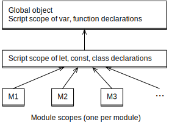

## 10.变量和赋值

> 原文： [http://exploringjs.com/impatient-js/ch_variables-assignment.html](http://exploringjs.com/impatient-js/ch_variables-assignment.html)

这些是 JavaScript 声明变量的主要方式：

*   `let`声明了可变变量。
*   `const`声明 _ 常量 _（不可变变量）。

在 ES6 之前，还有`var`。但它有几个怪癖，所以最好在现代 JavaScript 中避免它。您可以在[“Speaking JavaScript”](http://speakingjs.com/es5/ch16.html)中阅读更多相关信息。

### 10.1。 `let`

通过`let`声明的变量是可变的：

```js
let i;
i = 0;
i = i + 1;
assert.equal(i, 1);
```

您也可以同时申报和分配：

```js
let i = 0;
```

### 10.2。 `const`

通过`const`声明的变量是不可变的。您必须始终立即初始化：

```js
const i = 0; // must initialize

assert.throws(
  () => { i = i + 1 },
  {
    name: 'TypeError',
    message: 'Assignment to constant variable.',
  }
);
```

#### 10.2.1。 `const`和不变性

在 JavaScript 中，`const`仅表示 _ 绑定 _（变量名和变量值之间的关联）是不可变的。值本身可能是可变的，如下例中的`obj`。

```js
const obj = { prop: 0 };

// Allowed: changing properties of `obj`
obj.prop = obj.prop + 1;
assert.equal(obj.prop, 1);

// Not allowed: assigning to `obj`
assert.throws(
  () => { obj = {} },
  {
    name: 'TypeError',
    message: 'Assignment to constant variable.',
  }
);
```

#### 10.2.2。 `const`和循环

您可以将`const`与`for-of`循环一起使用，为每次迭代创建一个新的绑定：

```js
const arr = ['hello', 'world'];
for (const elem of arr) {
  console.log(elem);
}
// Output:
// 'hello'
// 'world'
```

在普通的`for`循环中，必须使用`let`，但是：

```js
const arr = ['hello', 'world'];
for (let i=0; i<arr.length; i++) {
  const elem = arr[i];
  console.log(elem);
}
```

### 10.3。在`let`和`const`之间做出决定

我推荐以下规则来决定`let`和`const`：

*   `const`表示不可变绑定，变量永远不会更改其值。喜欢它。
*   `let`表示变量的值发生变化。仅在无法使用`const`时使用。

 **练习：`const`**

`exercises/variables-assignment/const_exrc.js`

### 10.4。变量的范围

变量的 _ 范围 _ 是可以访问它的程序的区域。请考虑以下代码。

```js
{ // // Scope A. Accessible: x
  const x = 0;
  assert.equal(x, 0);
  { // Scope B. Accessible: x, y
    const y = 1;
    assert.equal(x, 0);
    assert.equal(y, 1);
    { // Scope C. Accessible: x, y, z
      const z = 2;
      assert.equal(x, 0);
      assert.equal(y, 1);
      assert.equal(z, 2);
    }
  }
}
// Outside. Not accessible: x, y, z
assert.throws(
  () => console.log(x),
  {
    name: 'ReferenceError',
    message: 'x is not defined',
  }
);
```

*   范围 A 是`x`的 _（直接）范围 _。
*   范围 B 和 C 是范围 A 的 _ 内部范围 _。
*   范围 A 是范围 B 和范围 C 的 _ 外部范围 _。

每个变量都可以在其直接范围内访问，所有范围都嵌套在该范围内。

通过`const`和`let`声明的变量称为 _ 块作用域 _，因为它们的作用域始终是最内层的周围块。

#### 10.4.1。阴影和块

您不能在同一级别声明两次相同的变量：

```js
assert.throws(
  () => {
    eval('let x = 1; let x = 2;');
  },
  {
    name: 'SyntaxError',
    message: "Identifier 'x' has already been declared",
  });
```

 **为什么`eval()`？**

我们需要通过 eval（）延迟解析，否则我们在解析此代码时会遇到异常。 `assert.throws()`仅在其函数体内抛出异常时才有效。

但是，您可以嵌套块并使用在块外部使用的相同变量名`x`：

```js
const x = 1;
assert.equal(x, 1);
{
  const x = 2;
  assert.equal(x, 2);
}
assert.equal(x, 1);
```

在块内，内部`x`是唯一具有该名称的可访问变量。内部`x`被称为 _ 阴影 _ 外部`x`。离开块后，您可以再次访问旧值。

 **测验：基本**

参见[测验应用程序](ch_quizzes-exercises.html#quizzes)。

### 10.5。 （高级）

所有剩余部分都是高级的。

### 10.6。术语：静态与动态

这两个形容词描述了编程语言中的现象：

*   _ 静态 _ 表示某些内容与源代码有关，可以在不执行代码的情况下确定。
*   _ 动态 _ 表示运行时。

我们来看看这两个术语的例子。

#### 10.6.1。静态现象：变量范围

可变范围是一种静态现象。请考虑以下代码：

```js
function f() {
  const x = 3;
  // ···
}
```

`x`是 _ 静态 _（或 _ 词汇 _）_ 作用范围 _。也就是说，它的范围是固定的，并且在运行时不会改变。

变量范围形成静态树（通过静态嵌套）。

#### 10.6.2。动态现象：函数调用

函数调用是一种动态现象。请考虑以下代码：

```js
function g(x) {}
function h(y) {
  if (Math.random()) g(y); // (A)
}
```

是否发生了 A 行中的函数调用，只能在运行时决定。

来自动态树的函数调用（通过动态调用）。

### 10.7。时间死区：在声明之前阻止对变量的访问

对于 JavaScript，TC39 需要决定如果在声明之前访问其直接作用域中的变量会发生什么：

```js
{
  console.log(x); // What happens here?
  let x;
}
```

一些可能的方法是：

1.  该名称在当前范围的范围内解析。
2.  如果你读，你得到`undefined`。您也可以写入变量。 （这就是`var`的工作原理。）
3.  有一个错误。

TC39 为`const`和`let`选择了（3），因为如果使用稍后在同一范围内声明的变量名，则可能会出错。 （2）不适用于`const`（其中每个变量应始终只具有初始化的值）。因此，`let`也被拒绝，因此两者的工作方式相似，并且很容易在它们之间切换。

输入变量范围和执行其声明之间的时间称为该变量的 _ 暂时死区 _（TDZ）：

```js
if (true) { // entering scope of `tmp`, TDZ starts
  // `tmp` is uninitialized:
  assert.throws(() => (tmp = 'abc'), ReferenceError);
  assert.throws(() => console.log(tmp), ReferenceError);

  let tmp; // TDZ ends
  assert.equal(tmp, undefined);
}
```

*   在此期间，变量被认为是未初始化的（就好像它是一个特殊值）。
*   如果访问未初始化的变量，则会得到`ReferenceError`。
*   到达变量声明后，变量将设置为初始化程序的值（通过赋值符号指定）或`undefined` - 如果没有初始化程序。

以下代码说明了时间死区：

```js
if (true) { // entering scope of `tmp`, TDZ starts
  // `tmp` is uninitialized:
  assert.throws(() => (tmp = 'abc'), ReferenceError);
  assert.throws(() => console.log(tmp), ReferenceError);

  let tmp; // TDZ ends
  assert.equal(tmp, undefined);
}
```

下一个例子显示时间死区真正 _ 时间 _（与时间有关）：

```js
if (true) { // entering scope of `myVar`, TDZ starts
  const func = () => {
    console.log(myVar); // executed later
  };

  // We are within the TDZ:
  // Accessing `myVar` causes `ReferenceError`

  let myVar = 3; // TDZ ends
  func(); // OK, called outside TDZ
}
```

即使`func()`位于`myVar`声明之前并使用该变量，我们也可以调用`func()`。但是我们必须等到`myVar`的暂时死区结束。

### 10.8。吊装

吊装意味着构造移动到其范围的开头，而不管它在该范围中的位置：

```js
assert.equal(func(), 123); // Works!

function func() {
  return 123;
}
```

您可以在声明之前使用`func()`，因为在内部它会被提升。也就是说，以前的代码实际上是这样执行的：

```js
function func() {
  return 123;
}

assert.equal(func(), 123);
```

时间死区可以被视为一种提升形式，因为声明会影响其范围开始时发生的事情。

 **有关提升功能的更多信息**

有关提升如何影响功能的更多信息，请参阅[关于可调用值](ch_callables.html#hoisting-functions)的章节。

### 10.9。全局变量

如果变量在顶级范围内声明，则该变量是全局变量。每个嵌套的作用域都可以访问这样的变量。在 JavaScript 中，有多个全局范围层（图 [5](#fig:global-scopes) ）：

*   最外层的全局范围是特殊的：它的变量可以通过对象的属性来访问，即所谓的 _ 全局对象 _。浏览器中的`window`和`self`引用全局对象。此范围内的变量通过以下方式创建：

    *   全局对象的属性
    *   [HTD0]脚本顶层的`var`和`function`。 （脚本由浏览器支持。它们是简单的代码片段和模块的前身。有关详细信息，请参阅[关于模块](ch_modules.html#scripts)的章节。）
*   嵌套在该范围内的是脚本的全局范围。此范围中的变量由脚本顶级的`let`，`const`和`class`创建。

*   嵌套在该范围内的是模块的范围。每个模块都有自己的全局范围。该范围中的变量由模块顶层的声明创建。



Figure 5: JavaScript has multiple global scopes.


#### 10.9.1。全球对象

全局对象允许您通过对象访问最外层的全局范围。两者总是同步的：

*   如果在最外层的全局范围中创建变量，则全局对象将获取新属性。如果更改此类全局变量，则属性会更改。
*   如果创建或删除全局对象的属性，则会创建或删除相应的全局变量。如果更改全局对象的属性，则相应的全局变量将更改。

全局对象可通过特殊变量获得：

*   `window`：是引用全局对象的经典方式。但它只适用于普通的浏览器代码，而不适用于 Node.js 而不适用于 _Web Workers_ （与正常浏览器代码同时运行的进程;有关详细信息，请参阅[关于异步编程的章节](ch_async-js.html#web-workers)）。
*   `self`：在浏览器中随处可用，包括 Web Workers。但是 Node.js 不支持它。
*   `global`：仅在 Node.js 中可用。

让我们来看看`self`是如何工作的：

```js
// At the top level of a script
var myGlobalVariable = 123;
assert.equal('myGlobalVariable' in self, true);

delete self.myGlobalVariable;
assert.throws(() => console.log(myGlobalVariable), ReferenceError);

// Create a global variable anywhere:
if (true) {
  self.anotherGlobalVariable = 'abc';
}
assert.equal(anotherGlobalVariable, 'abc');
```

#### 10.9.2。避免全局对象！

Brendan Eich 称全球对象是他对 JavaScript 最大的遗憾之一。最好不要将变量放入其范围：

*   通常，对网页上的所有脚本都是全局的变量会冒名称冲突。
*   通过全局对象，您可以在任何地方创建和删除全局变量。这样做会使代码无法预测，因为通常无法在嵌套作用域中进行此类更改。

您偶尔会在网络上的教程中看到`window.globalVariable`，但不需要前缀“`window.`”。我宁愿省略它：

```js
window.encodeURIComponent(str); // no
encodeURIComponent(str); // yes
```

### 10.10。关闭

在我们探索闭包之前，我们需要了解绑定变量和自由变量。

#### 10.10.1。绑定变量与自由变量

每个范围，都有一组提到的变量。在这些变量中我们区分：

*   _ 绑定变量 _ 在范围内声明。它们是参数和局部变量。
*   _ 自由变量 _ 在外部声明。它们也被称为 _ 非局部变量 _。

请考虑以下代码：

```js
function func(x) {
  const y = 123;
  console.log(z);
}
```

在`func()`的主体中，`x`和`y`是绑定变量。 `z`是一个自由变量。

#### 10.10.2。什么是关闭？

什么是闭合呢？

> _ 闭包 _ 是一个函数加上与其“出生地”存在的变量的连接。

保持这种联系有什么意义？它提供函数的自由变量的值。例如：

```js
function funcFactory(value) {
  return () => {
    return value;
  };
}

const func = funcFactory('abc');
assert.equal(func(), 'abc'); // (A)
```

`funcFactory`返回分配给`func`的闭包。因为`func`与其出生地处的变量有连接，所以当在行 A 中调用它时，它仍然可以访问自由变量`value`（即使它“转义”了它的范围）。

 ** JavaScript 中的所有函数都是闭包**

JavaScript 中的闭包支持静态作用域。因此，每个函数都是一个闭包。如果您对闭包的工作原理感兴趣，请参阅[“可变环境”](ch_remaining-chapters-preview.html)一章（如 ECMAScript 规范中所述）。

#### 10.10.3。示例：增量器的工厂

以下函数返回 _ 增量器 _（我刚刚编写的名称）。增量器是内部存储数字的函数。调用它时，它会通过向其添加参数来更新该数字并返回新值。

```js
function createInc(startValue) {
  return (step) => { // (A)
    startValue += step;
    return startValue;
  };
}
const inc = createInc(5);
assert.equal(inc(2), 7);
```

我们可以看到在 A 行创建的函数将其内部数字保存在自由变量`startValue`中。这一次，我们不只是从出生范围中读取，我们使用它来存储我们更改的数据以及在函数调用中持续存在的数据。

我们可以通过局部变量在出生范围内创建更多存储槽：

```js
function createInc(startValue) {
  let index = -1;
  return (step) => {
    startValue += step;
    index++;
    return [index, startValue];
  };
}
const inc = createInc(5);
assert.deepEqual(inc(2), [0, 7]);
assert.deepEqual(inc(2), [1, 9]);
assert.deepEqual(inc(2), [2, 11]);
```

#### 10.10.4。用例关闭

什么是关闭适合？

*   对于初学者来说，它们只是静态范围的实现。因此，它们为回调提供上下文数据。

*   函数也可以使用它们来存储跨函数调用持久存在的状态。 `createInc()`就是一个例子。

*   并且它们可以为对象提供私有数据（通过字面值或类生成）。有关其工作原理的详细信息，请参见[“探索 ES6”](http://exploringjs.com/es6/ch_classes.html#_private-data-via-constructor-environments)。

### 10.11。总结：声明变量的方法

Table 1: These are all the ways in which you declare variables in JavaScript.

|  | 吊装 | 范围 | 脚本范围是全局对象？ |
| --- | --- | --- | --- |
| `var` | 仅声明 | 功能 | `✔` |
| `let` | 时间死区 | 块 | `✘` |
| `const` | 时间死区 | 块 | `✘` |
| `function` | 一切 | 块 | `✔` |
| `class` | 没有 | 块 | `✘` |
| `import` | 一切 | 模 | `✘` |

TBL。 [1](#tbl:declaring-variables) 列出了在 JavaScript 中声明变量的所有方法：`var`，`let`，`const`，`function`，`class`和`import`。

 **测验：高级**

参见[测验应用程序](ch_quizzes-exercises.html#quizzes)。

### 10.12。进一步阅读

有关如何在引擎盖下处理变量的更多信息，请参阅[“可变环境”一章](ch_remaining-chapters-preview.html)。