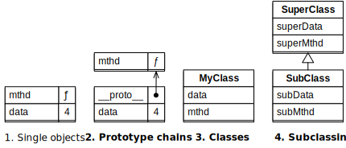
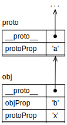
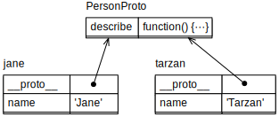
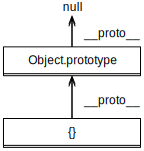
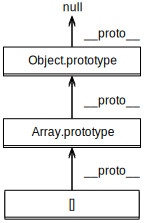
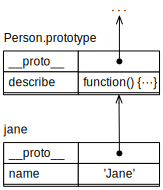

## 26.原型链和类

> 原文： [http://exploringjs.com/impatient-js/ch_proto-chains-classes.html](http://exploringjs.com/impatient-js/ch_proto-chains-classes.html)

在本书中，JavaScript 的面向对象编程（OOP）风格分四步介绍。本章包括步骤 2-4，[前一章](ch_single-objects.html)涵盖步骤 1.步骤为（图 [8](#fig:oop_steps2) ）：

1.  单个对象：_ 对象 _（JavaScript 的基本 OOP 构建块）如何独立工作？
2.  **原型链：**每个对象都有一个零个或多个 _ 原型对象链 _。原型是 JavaScript 的核心继承机制。
3.  **类：** JavaScript 的 _ 类 _ 是对象的工厂。类及其实例之间的关系基于原型继承。
4.  **子类化：** _ 亚类 _ 与其 _ 超类 _ 之间的关系也是基于原型继承。



Figure 8: This book introduces object-oriented programming in JavaScript in four steps.


### 26.1。原型链

原型是 JavaScript 唯一的继承机制：每个对象都有一个原型，它是`null`或一个对象。在后一种情况下，对象继承了所有原型的属性。

在对象字面值中，您可以通过特殊属性`__proto__`设置原型：

```js
const proto = {
  protoProp: 'a',
};
const obj = {
  __proto__: proto,
  objProp: 'b',
};

// obj inherits .protoProp:
assert.equal(obj.protoProp, 'a');
assert.equal('protoProp' in obj, true);
```

鉴于原型对象本身可以拥有原型，我们得到了一系列对象 - 所谓的 _ 原型链 _。这意味着继承给我们的印象是我们正在处理单个对象，但实际上我们处理的是对象链。

图 [9](#fig:oo_proto_chain) 显示`obj`的原型链是什么样的。


Figure 9: `obj` starts a chain of objects that continues with `proto` and other objects.


非继承属性称为 _ 自己的属性 _。 `obj`有一个属性`.objProp`。

#### 26.1.1。陷阱：只有原型链的第一个成员发生了变异

可能违反直觉的原型链的一个方面是通过对象设置 _ 任何 _ 属性 - 甚至是继承的 - 仅改变该对象 - 从不是原型之一。

考虑以下对象`obj`：

```js
const proto = {
  protoProp: 'a',
};
const obj = {
  __proto__: proto,
  objProp: 'b',
};
```

当我们在行 A 中设置继承属性`obj.protoProp`时，我们通过创建自己的属性来“更改”它：当读取`obj.protoProp`时，首先找到自己的属性，它的值将覆盖继承属性的值。

```js
assert.deepEqual(Object.keys(obj), ['objProp']);

obj.protoProp = 'x'; // (A)

// We created a new own property:
assert.deepEqual(Object.keys(obj), ['objProp', 'protoProp']);

// The inherited property itself is unchanged:
assert.equal(proto.protoProp, 'a');
```

`obj`的原型链如图 2 所示。 [10](#fig:oo_overriding) 。



Figure 10: The own property `.protoProp` of `obj` overrides the property inherited from `proto`.


#### 26.1.2。使用原型的提示（高级）

##### 26.1.2.1。避免`__proto__`（除了对象字面值）

我建议避免使用特殊属性`__proto__`：它是通过`Object.prototype`中的 getter 和 setter 实现的，因此只有在`Object.prototype`位于对象的原型链中时才可用。通常情况就是如此，但为了安全起见，您可以使用以下替代方案：

*   设置原型的最佳方法是创建对象。例如。通过：

    ```js
    Object.create(proto: Object) : Object
    ```

    如果必须，可以使用`Object.setPrototypeOf()`更改现有对象的原型。

*   获取原型的最佳方法是通过以下方法：

    ```js
    Object.getPrototypeOf(obj: Object) : Object
    ```

以下是这些功能的使用方法：

```js
const proto1 = {};
const proto2 = {};

const obj = Object.create(proto1);
assert.equal(Object.getPrototypeOf(obj), proto1);

Object.setPrototypeOf(obj, proto2);
assert.equal(Object.getPrototypeOf(obj), proto2);
```

请注意，对象字面值中的`__proto__`是不同的。在那里，它是一个内置功能，总是安全使用。

##### 26.1.2.2。检查：对象是另一个的原型吗？

更宽松的定义“`o`是`p`的原型”是“`o`在`p`的原型链中”。可以通过以下方式检查此关系：

```js
p.isPrototypeOf(o)
```

例如：

```js
const p = {};
const o = {__proto__: p};

assert.equal(p.isPrototypeOf(o), true);
assert.equal(o.isPrototypeOf(p), false);

// Object.prototype is almost always in the prototype chain
// (more on that later)
assert.equal(Object.prototype.isPrototypeOf(p), true);
```

#### 26.1.3。通过原型共享数据

请考虑以下代码：

```js
const jane = {
  name: 'Jane',
  describe() {
    return 'Person named '+this.name;
  },
};
const tarzan = {
  name: 'Tarzan',
  describe() {
    return 'Person named '+this.name;
  },
};

assert.equal(jane.describe(), 'Person named Jane');
assert.equal(tarzan.describe(), 'Person named Tarzan');
```

我们有两个非常相似的对象。两者都有两个属性，其名称为`.name`和`.describe`。另外，方法`.describe()`是相同的。我们怎样才能避免重复该方法？

我们可以将它移动到共享原型，`PersonProto`：

```js
const PersonProto = {
  describe() {
    return 'Person named ' + this.name;
  },
};
const jane = {
  __proto__: PersonProto,
  name: 'Jane',
};
const tarzan = {
  __proto__: PersonProto,
  name: 'Tarzan',
};
```

原型的名称反映出`jane`和`tarzan`都是人。



Figure 11: Objects `jane` and `tarzan` share method `.describe()`, via their common prototype `PersonProto`.


图中的图表 [11](#fig:oo_person_shared) 说明了三个对象是如何连接的：底部的对象现在包含特定于`jane`和`tarzan`的属性。顶部的对象包含它们之间共享的属性。

当您调用方法`jane.describe()`时，`this`指向该方法调用的接收者，`jane`（在图的左下角）。这就是该方法仍然有效的原因。当你打调用给`tarzan.describe()`时会发生类似的事情。

```js
assert.equal(jane.describe(), 'Person named Jane');
assert.equal(tarzan.describe(), 'Person named Tarzan');
```

### 26.2。类

我们现在准备接受类，这基本上是用于设置原型链的紧凑语法。虽然他们的基础可能是非常规的，但是如果您以前使用过面向对象的语言，那么使用 JavaScript 的类仍然应该感觉很熟悉。

#### 26.2.1。一类人

我们之前使用过`jane`和`tarzan`，代表人物的单个对象。让我们用一个班来为人们实施一个工厂：

```js
class Person {
  constructor(name) {
    this.name = name;
  }
  describe() {
    return 'Person named '+this.name;
  }
}
```

现在可以通过`new Person()`创建`jane`和`tarzan`：

```js
const jane = new Person('Jane');
assert.equal(jane.describe(), 'Person named Jane');

const tarzan = new Person('Tarzan');
assert.equal(tarzan.describe(), 'Person named Tarzan');
```

#### 26.2.2。类表达式

前一个类定义是 _ 类声明 _。还有 _ 匿名类表达式 _：

```js
const Person = class { ··· };
```

并且 _ 命名了类表达式 _：

```js
const Person = class MyClass { ··· };
```

#### 26.2.3。引擎盖下的课程（高级）

在课程的引擎下有很多事情要做。让我们看一下`jane`的图表（图 [12](#fig:oo_person_class) ）。


Figure 12: The class `Person` has the property `.prototype` that points to an object that is the prototype of all instances of `Person`. `jane` is one such instance.


类`Person`的主要目的是在右侧设置原型链（`jane`，然后是`Person.prototype`）。值得注意的是，类`Person`（`.constructor`和`.describe()`）内的两个构造都为`Person.prototype`创建了属性，而不是`Person`。

这种稍微奇怪的方法的原因是向后兼容性：在类之前，_ 构造函数 _（[普通函数](ch_callables.html#roles-of-ordinary-functions)，通过`new`运算符调用）通常用作对象的工厂。类通常是构造函数的更好语法，因此与旧代码保持兼容。这解释了为什么类是函数：

```js
> typeof Person
'function'
```

在本书中，我可以互换地使用术语 _ 构造函数（函数）_ 和 _ 类 _。

很多人混淆`.__proto__`和`.prototype`。希望图中的图表。 [12](#fig:oo_person_class) 清楚说明了它们的区别：

*   `.__proto__`是用于访问对象原型的特殊属性。
*   `.prototype`是一个普通的属性，由于`new`操作符的使用方式，它只是特殊的。名称并不理想：`Person.prototype`没有指向`Person`的原型，它指向`Person`的所有实例的原型。

##### 26.2.3.1。 `Person.prototype.constructor`

图中有一个细节。 [12](#fig:oo_person_class) 我们尚未查看，但是：`Person.prototype.constructor`指回`Person`：

```js
> Person.prototype.constructor === Person
true
```

由于历史原因，此设置也存在。但它也有两个好处。

首先，类的每个实例都继承属性`.constructor`。因此，给定一个实例，您可以通过它创建“类似”对象：

```js
const jane = new Person('Jane');

const cheeta = new jane.constructor('Cheeta');
// cheeta is also an instance of Person
// (the instanceof operator is explained later)
assert.equal(cheeta instanceof Person, true);
```

其次，您可以获取创建给定实例的类的名称：

```js
const tarzan = new Person('Tarzan');

assert.equal(tarzan.constructor.name, 'Person');
```

#### 26.2.4。类定义：原型属性

以下代码演示了创建`Foo.prototype`属性的类定义`Foo`的所有部分：

```js
class Foo {
  constructor(prop) {
    this.prop = prop;
  }
  protoMethod() {
    return 'protoMethod';
  }
  get protoGetter() {
    return 'protoGetter';
  }
}
```

让我们按顺序检查它们：

*   在创建`Foo`的新实例后调用`.constructor()`来设置该实例。
*   `.protoMethod()`是一种常规方法。它存储在`Foo.prototype`中。
*   `.protoGetter`是存储在`Foo.prototype`中的吸气剂。

以下交互使用类`Foo`：

```js
> const foo = new Foo(123);
> foo.prop
123

> foo.protoMethod()
'protoMethod'
> foo.protoGetter
'protoGetter'
```

#### 26.2.5。类定义：静态属性

下面的代码演示了类定义的所有部分，它们创建了所谓的 _ 静态属性 _ - 类本身的属性。

```js
class Bar {
  static staticMethod() {
    return 'staticMethod';
  }
  static get staticGetter() {
    return 'staticGetter';
  }
}
```

静态方法和静态吸气剂使用如下。

```js
> Bar.staticMethod()
'staticMethod'
> Bar.staticGetter
'staticGetter'
```

#### 26.2.6。 `instanceof`运算符

`instanceof`运算符告诉您某个值是否是给定类的实例：

```js
> new Person('Jane') instanceof Person
true
> ({}) instanceof Person
false
> ({}) instanceof Object
true
> [] instanceof Array
true
```

在我们查看子类化之后，我们将在后面中更详细地探索`instanceof`运算符。

#### 26.2.7。为什么我推荐课程

我推荐使用类，原因如下：

*   类是对象创建和继承的通用标准，现在跨框架（React，Angular，Ember 等）广泛支持。
*   他们帮助 IDE 和类型检查器等工具完成工作并启用新功能。
*   它们是未来功能的基础，例如值对象，不可变对象，装饰器等。
*   它们使新手更容易开始使用 JavaScript。
*   JavaScript 引擎优化它们。也就是说，使用类的代码通常比使用自定义继承库的代码更快。

这并不意味着课程是完美的。我和他们有一个问题是：

*   课程看起来与他们在幕后的不同。换句话说，语法和语义之间存在脱节。

如果类是（语法）构造函数 _ 对象 _（`new` - 原型对象）而不是构造函数 _ 函数 _，那将是很好的。但后向兼容性是他们成为后者的正当理由。

 **练习：实现一个类**

`exercises/proto-chains-classes/point_class_test.js`

### 26.3。类的私有数据

本节描述了从外部隐藏对象的一些数据的技术。我们在类的上下文中讨论它们，但它们也适用于通过对象字面值等直接创建的对象。

#### 26.3.1。私有数据：命名约定

第一种技术通过在其名称前加下划线来使属性成为私有属性。这不会以任何方式保护财产;它只是向外界发出信号：“你不需要知道这个房产。”

在以下代码中，属性`._counter`和`._action`是私有的。

```js
class Countdown {
  constructor(counter, action) {
    this._counter = counter;
    this._action = action;
  }
  dec() {
    if (this._counter < 1) return;
    this._counter--;
    if (this._counter === 0) {
      this._action();
    }
  }
}

// The two properties aren’t really private:
assert.deepEqual(
  Reflect.ownKeys(new Countdown()),
  ['_counter', '_action']);
```

使用这种技术，您不会得到任何保护，私人名称可能会发生冲突。从好的方面来说，它很容易使用。

#### 26.3.2。私人数据：WeakMaps

另一种技术是使用 WeakMaps。在[关于 WeakMaps](ch_weakmaps.html#private-data-via-weakmaps) 的章节中解释了究竟是如何工作的。这是预览：

```js
let _counter = new WeakMap();
let _action = new WeakMap();

class Countdown {
  constructor(counter, action) {
    _counter.set(this, counter);
    _action.set(this, action);
  }
  dec() {
    let counter = _counter.get(this);
    if (counter < 1) return;
    counter--;
    _counter.set(this, counter);
    if (counter === 0) {
      _action.get(this)();
    }
  }
}

// The two pseudo-properties are truly private:
assert.deepEqual(
  Reflect.ownKeys(new Countdown()),
  []);
```

这种技术为您提供了相当大的外部访问保护，并且不会有任何名称冲突。但使用起来也更复杂。

#### 26.3.3。更多私人数据技术

类的私有数据有更多技术。这些在[“探索 ES6”](http://exploringjs.com/es6/ch_classes.html#sec_private-data-for-classes)中进行了解释。

本节没有深入探讨的原因是 JavaScript 可能很快就会内置对私有数据的支持。请参阅 ECMAScript 提案[“类公共实例字段＆amp;私有实例字段“](https://github.com/tc39/proposal-class-fields)了解详情。

### 26.4。子类

类也可以子类化（“扩展”）现有类。例如，以下类`Employee`子类`Person`：

```js
class Person {
  constructor(name) {
    this.name = name;
  }
  describe() {
    return `Person named ${this.name}`;
  }
  static logNames(persons) {
    for (const person of persons) {
      console.log(person.name);
    }
  }
}

class Employee extends Person {
  constructor(name, title) {
    super(name);
    this.title = title;
  }
  describe() {
    return super.describe() +
      ` (${this.title})`;
  }
}

const jane = new Employee('Jane', 'CTO');
assert.equal(
  jane.describe(),
  'Person named Jane (CTO)');
```

两条评论：

*   在`.constructor()`方法中，必须先通过`super()`调用超级构造函数，然后才能访问`this`。那是因为在调用超级构造函数之前`this`不存在（这种现象特定于类）。

*   静态方法也是继承的。例如，`Employee`继承静态方法`.logNames()`：

    ```js
    > 'logNames' in Employee
    true
    ```

 **练习：子类化**

`exercises/proto-chains-classes/color_point_class_test.js`

#### 26.4.1。引擎盖下的子类（高级）


Figure 13: These are the objects that make up class `Person` and its subclass, `Employee`. The left column is about classes. The right column is about the `Employee` instance `jane` and its prototype chain.


上一节中的`Person`和`Employee`类由几个对象组成（图 [13](#fig:oo_subclassing) ）。理解这些对象如何相关的一个关键见解是，有两个原型链：

*   实例原型链，在右侧。
*   类原型链，在左边。

##### 26.4.1.1。实例原型链（右栏）

实例原型链以`jane`开始，并继续`Employee.prototype`和`Person.prototype`。原则上，原型链在此时结束，但我们还得到一个对象：`Object.prototype`。这个原型为几乎所有对象提供服务，这也是为什么它包含在这里：

```js
> Object.getPrototypeOf(Person.prototype) === Object.prototype
true
```

##### 26.4.1.2。类原型链（左栏）

在类原型链中，`Employee`首先出现，`Person`接下来。之后，链继续`Function.prototype`，只有那里，因为`Person`是一个功能，功能需要`Function.prototype`的服务。

```js
> Object.getPrototypeOf(Person) === Function.prototype
true
```

#### 26.4.2。 `instanceof`更详细（高级）

我们还没有看到`instanceof`如何真正起作用。给定表达式`x instanceof C`，`instanceof`如何确定`x`是否是`C`的实例？它通过检查`C.prototype`是否在`x`的原型链中来实现。也就是说，以下两个表达式是等效的：

```js
x instanceof C
C.prototype.isPrototypeOf(x)
```

如果我们回到图。 [13](#fig:oo_subclassing) ，我们可以确认原型链确实引导我们得到以下答案：

```js
> jane instanceof Employee
true
> jane instanceof Person
true
> jane instanceof Object
true
```

#### 26.4.3。内置对象的原型链（高级）

接下来，我们将使用我们的子类化知识来理解一些内置对象的原型链。以下工具功能`p()`帮助我们进行探索。

```js
const p = Object.getPrototypeOf.bind(Object);
```

我们提取`Object`的方法`.getPrototypeOf()`并将其分配给`p`。

##### 26.4.3.1。 `{}`的原型链

让我们从检查普通对象开始：

```js
> p({}) === Object.prototype
true
> p(p({})) === null
true
```



Figure 14: The prototype chain of an object created via an object literal starts with that object, continues with `Object.prototype` and ends with `null`.


图 [14](#fig:proto_chain_object) 显示了该原型链的图表。我们可以看到`{}`确实是`Object`的实例 - `Object.prototype`在其原型链中。

`Object.prototype`是一个奇怪的值：它是一个对象，但它不是`Object`的实例：

```js
> typeof Object.prototype
'object'
> Object.prototype instanceof Object
false
```

这是无法避免的，因为`Object.prototype`不能在自己的原型链中。

##### 26.4.3.2。 `[]`的原型链

Array 的原型链是什么样的？

```js
> p([]) === Array.prototype
true
> p(p([])) === Object.prototype
true
> p(p(p([]))) === null
true
```



Figure 15: The prototype chain of an Array has these members: the Array instance, `Array.prototype`, `Object.prototype`, `null`.


这个原型链（在图 [15](#fig:proto_chain_array) 中可视化）告诉我们一个 Array 对象是`Array`的一个实例，它是`Object`的子类。

##### 26.4.3.3。 `function () {}`的原型链

最后，普通函数的原型链告诉我们所有函数都是对象：

```js
> p(function () {}) === Function.prototype
true
> p(p(function () {})) === Object.prototype
true
```

##### 26.4.3.4。不是`Object`实例的对象

如果`Object.prototype`在其原型链中，则对象只是`Object`的实例。通过各种字面值创建的大多数对象是`Object`的实例：

```js
> ({}) instanceof Object
true
> (() => {}) instanceof Object
true
> /abc/ug instanceof Object
true
```

没有原型的对象不是`Object`的实例：

```js
> ({ __proto__: null }) instanceof Object
false
> Object.create(null) instanceof Object
false
```

`Object.prototype`结束了大多数原型链。它的原型是`null`，这意味着它不是`Object`的实例，也是：

```js
> Object.prototype instanceof Object
false
```

#### 26.4.4。调度与直接方法调用（高级）

让我们来看一下方法调用如何与类一起工作。我们从之前再次访问`jane`：

```js
class Person {
  constructor(name) {
    this.name = name;
  }
  describe() {
    return 'Person named '+this.name;
  }
}
const jane = new Person('Jane');
```

图 [16](#fig:jane_proto_chain) 有一个带有`jane`原型链的图表。



Figure 16: The prototype chain of `jane` starts with `jane` and continues with `Person.prototype`.


正常方法调用是 _ 调度 _。要使方法调用`jane.describe()`：

*   JavaScript 首先通过遍历原型链来查找`jane.describe`的值。
*   然后它调用它找到的函数，同时将`this`设置为`jane`。 `this`是方法调用的 _ 接收器 _（其中搜索属性`.describe`已启动）。

这种动态查找方法的方式称为 _ 动态调度 _。

您可以在绕过调度时进行相同的方法调用：

```js
Person.prototype.describe.call(jane)
```

这次，`Person.prototype.describe`是一个自己的属性，不需要搜索原型。我们还通过`.call()`自己指定`this`。

注意`this`总是指向原型链的开头。这使`.describe()`能够访问`.name`。这是突变发生的地方（如果方法想要设置`.name`）。

##### 26.4.4.1。借用方法

使用`Object.prototype`的方法时，直接方法调用很有用。例如，`Object.prototype.hasOwnProperty()`检查对象是否具有其键为给定的非继承属性：

```js
> const obj = { foo: 123 };
> obj.hasOwnProperty('foo')
true
> obj.hasOwnProperty('bar')
false
```

但是，可以覆盖此方法。然后调度的方法调用不起作用：

```js
> const obj = { hasOwnProperty: true };
> obj.hasOwnProperty('bar')
TypeError: obj.hasOwnProperty is not a function
```

解决方法是使用直接方法调用：

```js
> Object.prototype.hasOwnProperty.call(obj, 'bar')
false
> Object.prototype.hasOwnProperty.call(obj, 'hasOwnProperty')
true
```

这种直接方法调用通常缩写如下：

```js
> ({}).hasOwnProperty.call(obj, 'bar')
false
> ({}).hasOwnProperty.call(obj, 'hasOwnProperty')
true
```

JavaScript 引擎优化了这种模式，因此性能不应成为问题。

#### 26.4.5。 Mixin 课程（高级）

JavaScript 的类系统仅支持 _ 单继承 _。也就是说，每个类最多只能有一个超类。绕过这种限制的方法是通过称为 _mixin 类 _（简称： _mixins_ ）的技术。

这个想法如下：让我们假设有一个类`C`扩展了一个类`S` - 它的超类。 Mixins 是插入`C`和`S`之间的类片段。

在 JavaScript 中，您可以通过一个函数实现 mixin `Mix`，该函数的输入是一个类，其输出是 mixin 类片段 - 一个扩展输入的新类。要使用`Mix()`，请按如下方式创建`C`。

```js
class C extends Mix(S) {
  ···
}
```

我们来看一个例子：

```js
const Branded = S => class extends S {
  setBrand(brand) {
    this._brand = brand;
    return this;
  }
  getBrand() {
    return this._brand;
  }
};
```

我们使用这个 mixin 在`Car`和`Object`之间插入一个类：

```js
class Car extends Branded(Object) {
  constructor(model) {
    super();
    this._model = model;
  }
  toString() {
    return `${this.getBrand()} ${this._model}`;
  }
}
```

以下代码确认 mixin 有效：`Car`具有`Branded`的方法`.setBrand()`。

```js
const modelT = new Car('Model T').setBrand('Ford');
assert.equal(modelT.toString(), 'Ford Model T');
```

Mixins 比普通类更灵活：

*   首先，您可以在多个类中多次使用相同的 mixin。

*   其次，您可以同时使用多个 mixin。例如，考虑一个名为`Stringifiable`的附加 mixin，它有助于实现`.toString()`。我们可以使用`Branded`和`Stringifiable`如下：

    ```js
    class Car extends Stringifiable(Branded(Object)) {
      ···
    }
    ```

 **测验**

参见[测验应用程序](ch_quizzes-exercises.html#quizzes)。