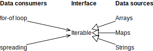

## 27.同步迭代

> 原文： [http://exploringjs.com/impatient-js/ch_sync-iteration.html](http://exploringjs.com/impatient-js/ch_sync-iteration.html)

### 27.1。什么是同步迭代？

同步迭代是一个 _ 协议 _（接口加上使用它们的规则），它连接 JavaScript 中的两组实体：

*   **数据来源：**一方面，数据有各种形状和大小。在 JavaScript 的标准库中，您有线性数据结构 Array，有序集合 Set（元素按添加时间排序），有序字典 Map（条目按添加时间排序）等等。在库中，您可以找到树形数据结构等。

*   **数据消费者：**另一方面，你有一整套机制和算法，只需要按顺序访问：一次一个，再加上告诉我什么时候完成的方法。示例包括`for-of`循环并扩展到数组字面值（通过`...`）。

迭代协议通过接口`Iterable`连接这两组：数据源按顺序“通过它”传递它们的内容;数据消费者通过它获得输入。

Figure 17: Data consumers such as the `for-of` loop use the interface `Iterable`. Data sources such as `Arrays` implement that interface.

图中的图表 [17](#fig:iterable-implementers-clients) 说明了迭代的工作原理：数据使用者使用接口`Iterable`;数据源实现它。请注意，在 JavaScript 中，实现的 _ 仅表示具有接口描述的方法;接口本身仅存在于规范中。_

数据的来源和消费者都从这种安排中获益：

*   如果您开发新的数据结构，则只需要实现`Iterable`，就可以立即应用大量工具。

*   如果编写使用迭代的代码，它会自动使用许多数据源。

### 27.2。核心迭代构造：iterables 和迭代器

两个角色（由接口描述）构成了迭代的核心（图 [18](#fig:iteration-protocol) ）：

*   _ 可迭代 _ 是一个对象，其内容可以顺序遍历。
*   _ 迭代器 _ 是用于遍历的指针。

Figure 18: Iteration has two main interfaces: `Iterable` and `Iterator`. The former has a method that returns the latter.

这些是迭代协议接口的类型定义（以 TypeScript 的表示法）：

接口使用如下：

*   通过键为`Symbol.iterator`的方法向`Iterable`询问迭代器。
*   `Iterator`通过其方法`.next()`返回迭代值。
*   这些值不会直接返回，而是包含在具有两个属性的对象中：
    *   `.value`是迭代值。
    *   `.done`表示是否已达到迭代结束。在最后一次迭代值和`false`之后是`true`。

### 27.3。手动迭代

这是使用迭代协议的示例：

#### 27.3.1。通过`while`迭代迭代

以下代码演示了如何使用`while`循环迭代迭代：

 **练习：手动使用同步迭代**

`exercises/sync-iteration-use/sync_iteration_manually_exrc.js`

### 27.4。实践中的迭代

我们已经看到了如何手动使用迭代协议，这是相对麻烦的。但该协议并不是直接使用的 - 它旨在通过构建在其上的更高级语言结构来使用。本节介绍了它的外观。

#### 27.4.1。数组

JavaScript 的数组是可迭代的。这使您可以使用`for-of`循环：

通过数组模式进行解构（稍后解释）也使用了迭代：

#### 27.4.2。集

JavaScript Set 数据结构是可迭代的。这意味着，`for-of`有效：

和数组解构一样：

### 27.5。快速参考：同步迭代

#### 27.5.1。可重复数据源

以下内置数据源是可迭代的：

*   数组
*   字符串
*   映射
*   集
*   （浏览器：DOM 数据结构）

要迭代对象的属性，您需要帮助程序，如`Object.keys()`和`Object.entries()`。这是必要的，因为属性存在于与数据结构级别互补的不同级别。

#### 27.5.2。迭代构造

以下构造支持迭代：

*   通过数组模式进行解构：

*   `for-of`循环：

*   `Array.from()`：

*   将（通过`...`）传播到数组和函数调用中：

*   `new Map()`和`new Set()`：

*   `Promise.all()`和`Promise.race()`：

*   `yield*`：

### 27.6。进一步阅读

有关同步迭代的更多详细信息，请参阅[“探索 ES6”](http://exploringjs.com/es6/ch_iteration.html)。

 **测验**

参见[测验应用程序](ch_quizzes-exercises.html#quizzes)。