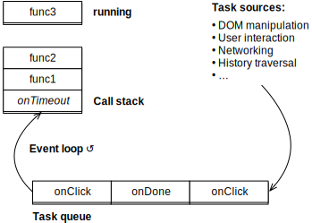

## 36\. JavaScript 中的异步编程

> 原文： [http://exploringjs.com/impatient-js/ch_async-js.html](http://exploringjs.com/impatient-js/ch_async-js.html)

本章介绍了 JavaScript 中异步编程的基础。

### 36.1。 JavaScript 中异步编程的路线图

本节提供了 JavaScript 中异步编程内容的路线图。

 **不要担心细节！**

如果你不理解一切，不要担心。这只是快速查看即将发生的事情。

#### 36.1.1。同步功能

正常函数是 _synchronous_ ：调用者等待被调用者完成计算。第（A）行中的`divideSync()`是同步函数调用：

```js
function main() {
  try {
    const result = divideSync(12, 3); // (A)
    assert.equal(result, 4);
  } catch (err) {
    assert.fail(err);
  }
}
```

#### 36.1.2。 JavaScript 在单个进程中按顺序执行任务

默认情况下，JavaScript _ 任务 _ 是在单个进程中按顺序执行的函数。看起来像这样：

```js
while (true) {
  const task = taskQueue.dequeue();
  task(); // run task
}
```

此循环也称为 _ 事件循环 _，因为单击鼠标等事件会将任务添加到队列中。

由于这种协作式多任务方式，我们不希望任务阻止其他任务被执行，例如，它等待来自服务器的结果。下一节将探讨如何处理这种情况。

#### 36.1.3。基于回调的异步函数

如果`divide()`需要服务器来计算其结果怎么办？然后结果应该以不同的方式传递：调用者不必等待（同步）直到结果准备好，它应该被通知（异步）。异步传递结果的一种方法是给`divide()`一个回调函数，用于通知调用者。

```js
function main() {
  divideCallback(12, 3,
    (err, result) => {
      if (err) {
        assert.fail(err);
      } else {
        assert.equal(result, 4);
      }
    });
}
```

这是异步函数调用`divideCallback(x, y, callback)`后发生的情况：

*   `divideCallback()`向服务器发送请求。
*   然后当前任务完成（暂时）并且可以执行其他任务。
*   When a response from the server arrives, it is either:
    *   错误`err`：然后将以下任务添加到队列中。
    
        ```js
        taskQueue.enqueue(() => callback(err));
        ```

    *   结果`r`：然后将以下任务添加到队列中。
    
        ```js
        taskQueue.enqueue(() => callback(null, r));
        ```

#### 36.1.4。基于 Promise 的异步函数

Promise 是两件事：

*   一种标准模式，可以更轻松地处理回调。
*   构建 _ 异步函数 _（下一节的主题）的机制。

调用基于 Promise 的函数如下所示。

```js
function main() {
  dividePromise(12, 3)
    .then(result => assert.equal(result, 4))
    .catch(err => assert.fail(err));
}
```

#### 36.1.5。异步功能

查看异步函数的一种方法是为基于 Promise 的代码提供更好的语法：

```js
async function main() {
  try {
    const result = await dividePromise(12, 3); // (A)
    assert.equal(result, 4);
  } catch (err) {
    assert.fail(err);
  }  
}
```

我们在 A 行调用的`dividePromise()`与前一节中基于 Promise 的函数相同。但是我们现在具有用于进行调用的同步语法。 `await`只能在特殊功能中使用，_ 异步功能 _（注意关键字`function`前面的关键字`async`）。 `await`暂停当前的异步功能并从中返回。一旦等待结果准备就绪，该功能的执行将从中断处继续。

#### 36.1.6。下一步

*   在本章中，我们将看到同步函数调用的工作原理。我们还将通过其 _ 事件循环 _ 探索 JavaScript 在单个进程中执行代码的方式。
*   [本章还介绍了通过回调](ch_async-js.html#callback-pattern)的异步性。
*   以下章节涵盖 [Promises](ch_promises.html) 和[异步函数](ch_async-functions.html)。
*   这一系列关于异步编程的章节以[结束了关于异步迭代的一章](ch_remaining-chapters-preview.html)，它类似于[同步迭代](ch_sync-iteration.html)，但是迭代值是异步传递的。

### 36.2。调用堆栈

每当一个函数调用另一个函数时，我们需要记住在后一个函数完成后返回的位置。这通常是通过堆栈完成的，_ 调用堆栈 _：调用者将其返回到该位置，并且被调用者在完成后跳转到该位置。

这是几个调用发生的示例：

```js
function h(z) {
  const error = new Error();
  console.log(error.stack);
}
function g(y) {
  h(y + 1);
}
function f(x) {
  g(x + 1);
}
f(3);
// done
```

最初，在运行这段代码之前，调用堆栈是空的。在第 11 行的函数调用`f(3)`之后，堆栈有一个条目：

*   第 12 行（顶级范围内的位置）

在第 9 行的函数调用`g(x + 1)`之后，堆栈有两个条目：

*   第 10 行（`f()`中的位置）
*   第 12 行（顶级范围内的位置）

在第 6 行的函数调用`h(y + 1)`之后，堆栈有三个条目：

*   第 7 行（`g()`中的位置）
*   第 10 行（`f()`中的位置）
*   第 12 行（顶级范围内的位置）

在第 2 行中创建异常是另一个调用。这就是在异常`error`内记录的调用堆栈包含`h()`内的位置的原因。记录`error`会产生以下输出（请注意，堆栈跟踪记录了调用的位置，而不是返回位置）：

```js
Error
    at h (demos/async-js/stack_trace.js:2:17)
    at g (demos/async-js/stack_trace.js:6:3)
    at f (demos/async-js/stack_trace.js:9:3)
    at <top level> (demos/async-js/stack_trace.js:11:1)
```

然后，每个函数终止，每次从堆栈中删除顶部条目。函数`f`完成后，我们回到顶级范围，调用堆栈为空。当代码片段结束时，那就像隐式`return`。如果我们将代码片段视为已执行的任务，则使用空调用堆栈返回将结束任务。

### 36.3。事件循环

默认情况下，JavaScript 在单个进程中运行 - 在 Web 浏览器和 Node.js 中。所谓的 _ 事件循环 _ 在该进程内依次执行 _ 任务 _（代码片段）。事件循环如图 2 所示。 [20](#fig:event_loop) 。



Figure 20: _Task sources_ add code to run to the _task queue_, which is emptied by the _event loop_.


双方访问任务队列：

*   _ 任务源 _ 将任务添加到队列中。其中一些源同时运行到 JavaScript 进程。例如，一个任务源负责用户界面事件：如果用户单击某处并触发 JavaScript 代码，则该代码将添加到任务队列中。

*   _ 事件循环 _ 在 JavaScript 进程内连续运行。它从队列中取出一个任务并执行它。一旦调用堆栈为空并且存在`return`，则当前任务完成。控制返回到事件循环，然后从队列中检索下一个任务并执行它。等等。

以下 JavaScript 代码是事件循环的近似值：

```js
while (true) {
  const task = taskQueue.dequeue();
  task(); // run task
}
```

### 36.4。如何避免阻止 JavaScript 进程

#### 36.4.1。可以阻止浏览器的用户界面

许多浏览器的用户界面机制也在 JavaScript 进程中运行（作为任务）。因此，长时间运行的 JavaScript 代码可能会阻止用户界面。让我们看一下展示这一点的网页。您可以通过两种方式试用该页面：

*   您可以[在线运行](http://rauschma.github.io/async-examples/blocking.html)。
*   您可以使用练习在存储库中打开以下文件：`demos/async-js/blocking.html`

以下 HTML 是页面的用户界面：

```html
<a id="block" href="">Block</a>
<div id="statusMessage"></div>
<button>Click me!</button>
```

这个想法是你单击“阻止”，并通过 JavaScript 执行长时间运行的循环。在该循环期间，您无法单击该按钮，因为浏览器/ JavaScript 进程被阻止。

JavaScript 代码的简化版本如下所示：

```js
document.getElementById('block')
  .addEventListener('click', doBlock); // (A)
  
function doBlock(event) {
  // ···
  setStatus('Blocking...');
  // ···
  sleep(5000); // (B)
  setStatus('Done');
}

function sleep(milliseconds) {
  const start = Date.now();
  while ((Date.now() - start) < milliseconds);
}
function setStatus(status) {
  document.getElementById('statusMessage')
    .textContent = status;
}
```

这些是代码的关键部分：

*   A 行：我们告诉浏览器只要点击 ID 为`block`的 HTML 元素就调用`doBlock()`。
*   `doBlock()`运行循环 5000 毫秒（B 行）。
*   `sleep()`执行实际循环。
*   `setStatus()`显示 ID 为`statusMessage`的`<div>`内的状态信息。

#### 36.4.2。我们如何避免阻止浏览器？

有几种方法可以阻止长时间运行的操作阻止浏览器：

*   该操作可以异步传递其结果：某些操作（如下载）可以与 JavaScript 进程同时执行。触发此类操作的 JavaScript 代码会注册一个回调，一旦操作完成，就会调用该回调。通过任务队列处理调用。这种传递结果的方式称为 _ 异步 _，因为调用者不会等到结果准备就绪。正常函数调用同步传递其结果。

*   在不同的进程中执行长计算：这可以通过所谓的 _Web Workers_ 来完成。 Web Workers 是与主进程同时运行的重量级进程。它们中的每一个都有自己的运行时环境（全局变量等）。它们是完全隔离的，必须通过消息传递进行通信。有关更多信息，请参阅 [MDN Web 文档](https://developer.mozilla.org/en-US/docs/Web/API/Web_Workers_API)。

*   在长时间计算期间休息。下一节将介绍如何操作。

#### 36.4.3。休息一下

延迟`ms`毫秒后，以下全局函数执行其参数`callback`（简化了类型定义 - `setTimeout()`具有更多功能）：

```js
function setTimeout(callback: () => void, ms: number): any
```

该函数返回一个 _ 句柄 _（一个 ID），可通过以下全局函数用于 _ 清除 _（取消）它：

```js
function clearTimeout(handle?: any): void
```

`setTimeout()`在浏览器和 Node.js 上都可用。下一节将展示它的实际效果。

 ** `setTimeout()`让任务休息**

另一种查看`setTimeout()`的方法是当前任务需要休息并在稍后通过回调继续。

#### 36.4.4。运行到完成语义

JavaScript 为任务提供以下保证：

> 在执行下一个任务之前，每个任务总是完成（“运行到完成”）。

这意味着任务在处理数据时不必担心数据被更改（_ 并发修改 _）。这简化了 JavaScript 中的编程。

以下示例演示了此保证：

```js
console.log('start');
setTimeout(() => {
  console.log('callback');
}, 0);
console.log('end');

// Output:
// 'start'
// 'end'
// 'callback'
```

`setTimeout()`将其参数放入任务队列。因此，在完成当前代码（任务）之后的某个时间执行该参数。

参数`ms`仅指定将任务放入队列的时间，它不指定任务何时运行。如果在队列中有一个永不终止的任务，它甚至可能永远不会运行。这就解释了为什么前面的代码在`'delayed'`之前记录`'end'`，即使延迟是零毫秒。

### 36.5。用于提供异步结果的模式

这些是在 JavaScript 中异步传递结果的三种流行模式：

*   活动
*   回调
*   Promise

接下来解释前两种模式。Promise 将在下一章解释。

#### 36.5.1。通过事件提供异步结果

作为模式的事件工作如下：

*   它们用于异步传递值。
*   他们这样做了零次或多次。
*   这种模式有三个角色：
    *   _ 事件 _（对象）携带要传递的数据。
    *   _ 事件监听器 _ 是一个通过参数接收事件的函数。
    *   _ 事件源 _ 发送事件并允许您注册事件侦听器。

JavaScript 的世界中存在这种模式的多种变体。接下来我们将看三个例子。

##### 36.5.1.1。事件：IndexedDB

IndexedDB 是内置于 Web 浏览器中的数据库。这是使用它的一个例子：

```js
const openRequest = indexedDB.open('MyDatabase', 1); // (A)

openRequest.onsuccess = (event) => {
  const db = event.target.result;
  // ···
};

openRequest.onerror = (error) => {
  console.error(error);
};
```

`indexedDB`有一种不寻常的调用操作方式：

*   每个操作都有一个相关的方法来创建 _ 请求对象 _。例如，在行 A 中，操作是“打开”，方法是`.open()`，请求对象是`openRequest`。

*   操作的参数通过请求对象提供，而不是通过方法的参数提供。例如，事件侦听器（函数）存储在属性`.onsuccess`和`.onerror`中。

*   通过该方法将操作的调用添加到任务队列中（在行 A 中）。也就是说，我们在之后配置操作 _，其调用已经添加到队列中。只有 run-to-completion 语义才能保存我们的竞争条件，并确保在当前代码片段完成后运行。_

##### 36.5.1.2。活动：`XMLHttpRequest`

`XMLHttpRequest` API 允许您从 Web 浏览器中进行下载。这是你下载文件`http://example.com/textfile.txt`的方法：

```js
const xhr = new XMLHttpRequest(); // (A)
xhr.open('GET', 'http://example.com/textfile.txt'); // (B)
xhr.onload = () => { // (C)
  if (xhr.status == 200) {
    processData(xhr.responseText);
  } else {
    assert.fail(new Error(xhr.statusText));
  }
};
xhr.onerror = () => { // (D)
  assert.fail(new Error('Network error'));
};
xhr.send(); // (E)

function processData(str) {
  assert.equal(str, 'Content of textfile.txt\n');
}
```

使用此 API，首先创建一个请求对象（行 A），然后对其进行配置，然后发送它（行 E）。配置包括：

*   指定要使用的 HTTP 请求方法（B 行）：`GET`，`POST`，`PUT`等。
*   注册一个监听器（C 行），如果可以下载某些内容，则通知该监听器。在侦听器内部，您仍需要确定下载是否包含您请求的内容或通知您错误。请注意，某些结果数据通过`xhr`传送。我不是这种输入和输出数据混合的粉丝。
*   注册如果出现网络错误，将收到通知的侦听器（D 行）。

##### 36.5.1.3。事件：DOM

我们已经在[关于阻止浏览器 UI](ch_async-js.html#blocking-browsers) 的部分中看到了 DOM 事件的实际应用。以下代码还处理`click`事件：

```js
const element = document.getElementById('my-link'); // (A)
element.addEventListener('click', clickListener); // (B)

function clickListener(event) {
  event.preventDefault(); // (C)
  console.log(event.shiftKey); // (D)
}
```

我们首先要求浏览器检索 ID 为`my-link`的 HTML 元素（行 A）。然后我们为所有`click`事件添加一个监听器（B 行）。在监听器中，我们首先告诉浏览器不要执行其默认操作 - 转到链接的目标（行 C）。然后，如果当前按下 shift 键，我们将登录到控制台（D 行）。

#### 36.5.2。通过回调传递异步结果

回调是处理异步结果的另一种模式。它们仅用于一次性结果，并且具有比事件更简洁的优点。

例如，考虑一个函数`readFile()`，它读取文本文件并异步返回其内容。如果它使用 Node.js 样式的回调，这就是你调用`readFile()`的方法：

```js
readFile('some-file.txt', {encoding: 'utf8'},
  (error, data) => {
    if (error) {
      assert.fail(error);
      return;
    }
    assert.equal(data, 'The content of some-file.txt\n');
  });
```

只有一个回调可以处理成功和失败。如果第一个参数不是`null`，则发生错误。否则，结果可以在第二个参数中找到。

 **练习：基于回调的代码**

以下练习使用异步代码测试，这与同步代码测试不同。有关详细信息，请参阅[有关 mocha](ch_quizzes-exercises.html#async-tests-mocha) 中异步测试的部分（在测试章节中）。

*   从同步代码到基于回调的代码：`exercises/async-js/read_file_cb_exrc.js`
*   实现基于回调的`.map()`版本：`exercises/async-js/map_cb_test.js`

### 36.6。异步代码：缺点

在许多情况下，无论是浏览器还是 Node.js，您别无选择：必须使用异步代码。在本章中，我们已经看到了这些代码可以使用的几种模式。所有这些都有两个缺点：

*   异步代码比同步代码更冗长。
*   如果调用异步代码，则代码也必须变为异步。那是因为你不能同步等待异步结果。异步代码具有传染性。

Promise 的第一个缺点变得不那么严重（在下一章中讨论），并且大部分消失了异步函数（在下一章之后的章节中介绍）。

唉，异步代码的传染性并没有消失。但是，使用异步功能可以轻松地在同步和异步之间切换，从而减轻了这种情况。

### 36.7。资源

*   [“帮助，我陷入了事件循环”](https://vimeo.com/96425312)，Philip Roberts（视频）。
*   [“事件循环”](https://www.w3.org/TR/html5/webappapis.html#event-loops)，HTML5 规范中的部分。